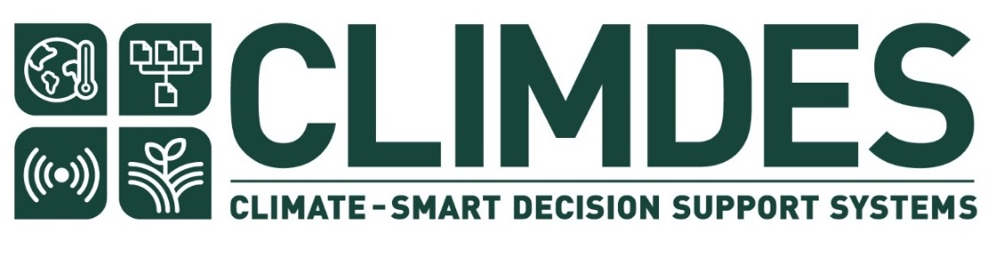

# CLIMDES Internship Website


## Overview

This repository contains the source code for the CLIMDES Internship website. The website serves as a platform for showcasing internship opportunities, allowing visitors to explore, apply, and learn more about the CLIMDES internship program. It's built using basic HTML, CSS, and JavaScript/jQuery for interactivity.

## Installation

To run the project locally, follow these installation steps:

1. **Clone the Repository**:
  Clone this repository to your local machine using Git.
  ```bash
  git clone https://github.com/dearlydebbie/climdes.git
  ```

2. **Navigate to the Project Directory**:
  Change your current directory to the project folder.
  ```bash
  cd climdes
  ```

3. **Open in a Web Browser**:
  Simply open the `index.html` file in a web browser to view the website.
  ```bash
  open index.html
  ```

## Usage

### Navigation

The website consists of several sections, including "Home," "About," and "Internships." You can navigate between these sections using the navigation menu.

### Internship Opportunities

- The "Internships" section displays a list of available internship opportunities.
- By default, all opportunities are displayed.
- You can filter opportunities by category (e.g., "Technical" or "Non-Technical") using the filter buttons provided.

### Smooth Scrolling

Clicking the "Apply Now" button in the "Home" section smoothly scrolls to the "Internships" section.

## Project Structure

The project is organized into the following directories and files:

- `index.html`: The main HTML file that defines the structure and content of the website.
- `style.css`: The CSS file responsible for styling the website.
- `script.js`: The JavaScript file, including jQuery, for interactivity and dynamic content loading.
- `Images/`: This directory contains images used in the project.
- `internships.json`: A JSON file that simulates internship data (for demonstration purposes).

## Additional Information

- The website design is responsive and adapts to different screen sizes, providing an optimal viewing experience on various devices.
- The JavaScript code fetches internship data from a JSON file (simulating an external API) and dynamically populates the "Internships" section.
- Error handling is implemented to display appropriate messages in case of data retrieval issues.

## Compatibility

The website has been tested and confirmed to work on the following browsers:

- Google Chrome
- Mozilla Firefox
- Apple Safari

## Screenshots

Here are some screenshots of the CLIMDES Internship Website:


*Home Section*


*About Section*


*Internships*


*Footer*

## Live Demo

To view a live demo of the CLIMDES Internship Website, visit [this link](https://dearlydebbie.github.io/Climdes/).